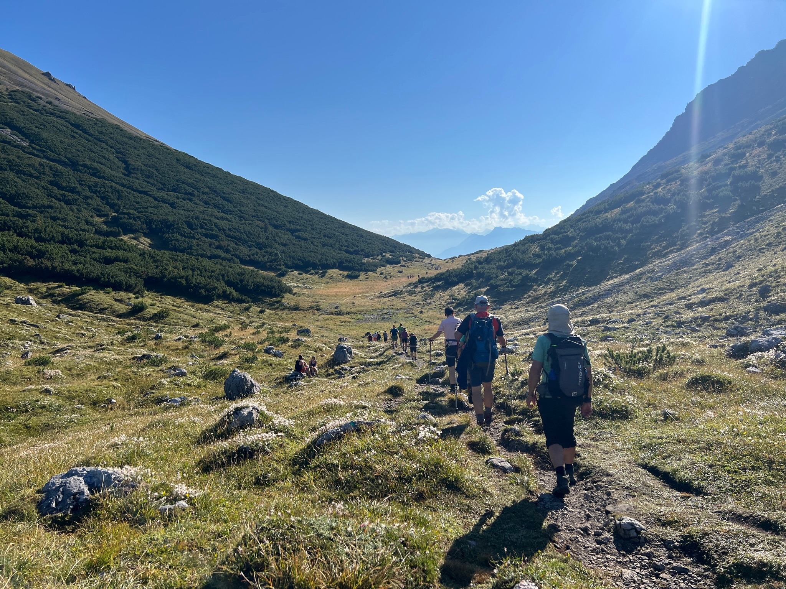

# Tag 1 – Die Anreise
7:00 in München: Nach einem langen Vorabend raffe ich mich auf, endlich meinen Rucksack zu packen und meine Verpflegung für eine Woche wandern einzukaufen. Der DAV Bus mit dem Rest der Truppe ist schon in Hof losgefahren, aber Team "Anreise ab München" erledigt seine Tourvorbereitungen eben gerne auf den letzten Drücker. Um kurz vor zehn hab ich's dann aber auch geschafft und sitze mit Tina, Sophia, Kaffee und guter Laune im Auto in Richtung Rätikon!

Dort angekommen heißt's kurz auf die anderen warten, bevor es dann endlich los geht. Wir wollen auf dieser Tour hoch hinaus, dafür erlauben wir uns die ersten Meter zum Lüner See mit der Gondel zu fahren. An der Bergstation melden wir uns kurz in der Douglasshütte an, wo wir die erste Nacht verbringen, bevor sich unsere Truppe zu einer Runde um den Lüner See aufmacht.

Umgeben von schroffen Bergspitzen und dem blau strahlenden Lüner Stausee genießen wir die Eindrücke, und werden von unserer Bergbegeisterung nur durch eine Begegnung mit einer die Sonne genießenden Kreuzotter unterbrochen. In der Hütte gibt's nach dem Abendessen noch mal ein kurzes Briefing zum nächsten Tag, und dann ziehen sich auch schon Alle in ihre Stockbetten zurück.

# Tag 2
Am zweiten Tag ging's direkt auf die technisch anspruchsvollste Wanderung der Tour. Übers Saulajoch steigen wir auf den Saulakopf (2517 Hm) auf. Vor dem Anstieg zum Gipfel machen wir eine kurze Pause, wo sich der Eine oder Andere sicherheitshalber mal das Klettersteig Set anlegt. Nach einiger Kraxelei kommen alle wohlbehalten und glücklich über die eigene Leistung am Gipfel an und genießen den ersten Ausblick über das Rätikon.

Beim Abstieg teilt sich die Gruppe dann in zwei. Die eine Hälfte genießt am Saulajoch noch etwas die Sonne, während die andere zurück eilt, um sich mit Cappuccino zu stärken.

Alle wieder vereint und mit Kaffee und Kuchen in den Bäuchen steigen wir gemeinsam noch auf die Totalmhütte auf, wo wir die nächste Nacht verbringen. Ein paar Verrückte steigen auch noch mal zum Totalpsee ab, um festzustellen, dass es sich selbst im nur hüfttiefen Wasser noch ganz gut baden lässt.

# Tag 3
Heute geht's auf den höchsten Gipfel unserer Tour, die Schesaplana (2965 Hm). Wir sind schon früh unterwegs und können die Ruhe in den Bergen genießen, noch bevor die ersten Tagestouristen sich auf den Weg machen. Der Aufstieg zum Gipfel ist geprägt durch Steine, Geröll und Felsmassive. Die Landschaft hier oben hat sich schon sehr zum alpinen verändert und obwohl einige seilversicherte Stellen dabei sind, schaffen alle den Aufstieg mühelos.

Am Gipfel dürfen wir bei Käsebrot und Gipfelschnaps den Ausblick genießen und die Überreste des ehemals riesigen Gletschers bestaunen.
Vor dem Abendessen gibt es noch mal einen kurzen Abstecher zur Gamsluggen, wo wir einmal testen, wer sich den Abstieg auf die Schweizer Seite über den Steig zutraut.

# Tag 4
Heute teilt sich die Gruppe auf, ein Teil macht sich auf den Weg durch die Gamsluggen zur Schweizer Seite des Rätikon, während der andere über den Lüner See in Richtung Lindauer Hütte wandert. Für mich ist heute ein großer Wunsch auf dieser Tour in Erfüllung gegangen, ich habe zum ersten Mal in meinem Leben Murmeltiere gesehen! Mit ordentlich Winterspeck angefuttert sonnen sich die kleinen Nager in der Spätsommer Sonne und sind wirklich an allen Ecken und Enden zu entdecken.
Über viele Jöcher und mit großartigem Blick aufs Schweizer Tor geht es heute überwiegend bergab, bis wir am späten Nachmittag, gestärkt durch frisches Bergwasser, alle an der Lindauerhütte ankommen.

Wie an allen anderen Abenden auch, so sitzen wir auch in der Lindauerhütte abends gemütlich alle beisammen, und unsere kompetitiven Seiten dürfen beim Mucken, Phase zehn oder Baptisten Skat ausgelebt werden, bevor wir uns müde in unser Lager zurückziehen.

# Tag 5
Heute Morgen sieht es irgendwie anders aus als die restlichen Tage. Es regnet. Ohne Zeitdruck können wir daher ausführlich frühstücken, bevor wir uns, dem Wetter zum trotze, auf den Weg auf den Geißspitz machen.

Im Aufstieg müssen wir gut aufpassen, keinen der unzähligen schwarzen Salamander aus Versehen unter unsere Wanderschuhe zu bekommen. Oben angekommen haben wir trotz schlechtem Wetter einen guten Ausblick auf den Grat, der vor uns liegt und die Golm in der Ferne. In unsere Regenjacken eingemummelt ziehen wir weiter über den Grat, vorbei am wilden Mann, hin zu nächsten Alm. Die ist leider nicht bewirtet, aber mit einem fantastischen Käsesortiment im SB Kühlschrank ausgestattet. Gibt's hier erst mal Brotzeit für alle.
Jetzt aber zurück, denn in der Lindauerhütte wartet auf uns die Sauna, um uns wieder auf zu wärmen. Was für ein Luxus!

# Tag 6

Heute ist der letzte Tag und obwohl es schade ist, dass unsere Wanderung zu Ende geht, ziehen wir trotzdem noch mal begeistert los, um unseren Weg über die vielen Jöcher zurück zur Douglas Hütte zu bewältigen. Und weil am Ende sogar noch mal kurz die Sonne durch scheint, überwindet sich ein Teil der Truppe noch mal kurz und verbotenerweise eine Runde im Lüner See schwimmen zu gehen.

Zurück an der Douglas Hütte gibt es eine letzte gemeinsame Mahlzeit, bevor wir alle mit der Gondel zum Parkplatz hinab fahren und uns von unseren alten und neugewonnenen Freunden und Familie zu verabschieden. Bis zum nächsten Jahr!
