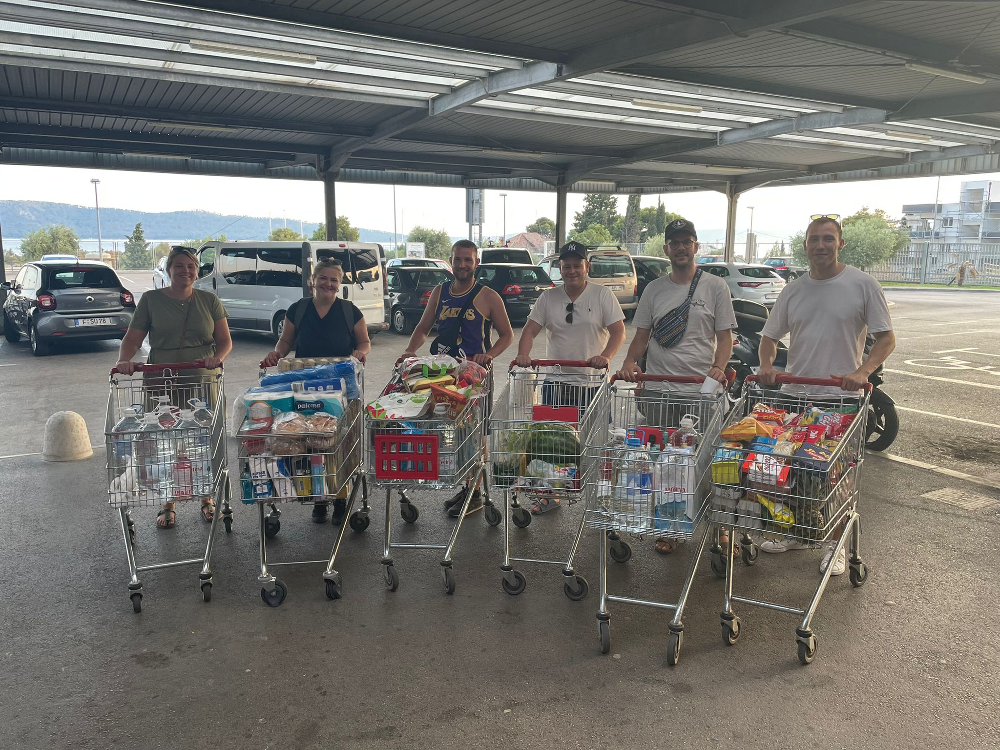
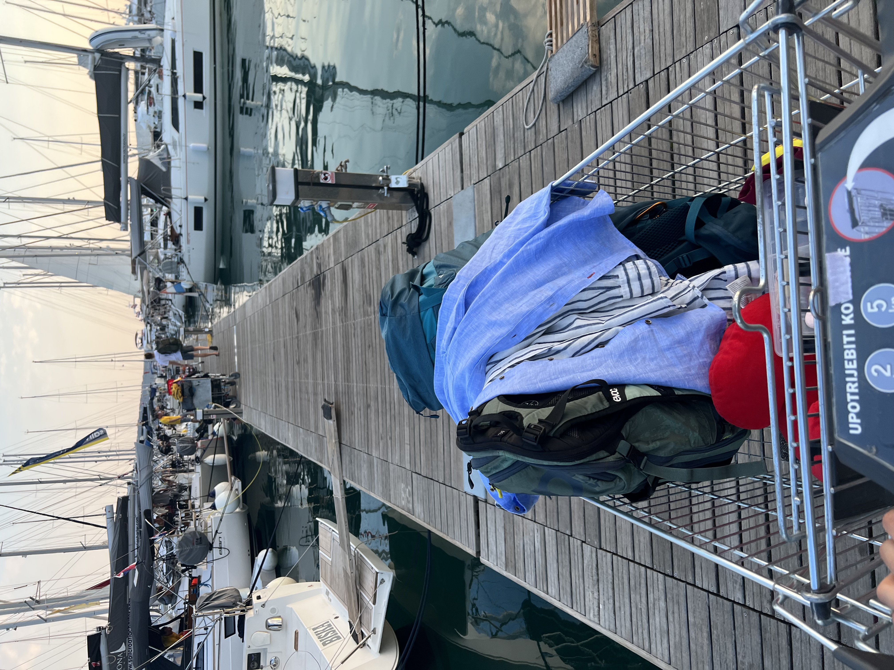

---

slug: "/blog/segeltoern-in-kroatien"
date: "2022-08-30 14:14:30"
title: "Mein erster Segeltörn"
tags: ["blog"]
featuredImage: ./featured.jpeg

---

Es ist der August 2022, in Deutschland wird die 40°C Marke geknackt, und ich brauche dringend Urlaub, eine Pause von der Arbeit und Abkühlung im Wasser. Immer auf der Suche nach neuen Erlebnissen habe ich mich daher relativ spontan zu einem einwöchigen Segeltrip bei [sailwithus](https://www.sailwithus.de/) angemeldet.

Die Organisation für so einen Törn fängt schon an, lange bevor sich die Crew zum ersten mal persönlich sieht. WhatsApp-Gruppen werden erstellt, das Essen wird geplant, Leute stellen sich vor und dann wird noch gecheckt, ob nicht spontan die ein oder anderen Leute gemeinsam anreisen können. Ich hole spontan Sarah und Harry vom Busbahnhof in Split ab, und wir lassen es uns erstmal bei einem Coldbrew gut gehen.

Den Rest haben wir dann zum ersten mal im "Real-Life" am Samstag Nachmittag in einer Strandbar neben der [Marina Kaštela](https://www.marina-kastela.hr/) getroffen. Hier lernen wir uns kennen, besprechen nochmal den Speiseplan und warten schon ganz gespannt auf unsere Skipperin Xenia, die in der Zwischenzeit das Boot vom Charterer abgenommen hat.

Ein paar Minuten später kommt Xenia schon vorbei, und wir freuen uns schon, dass es endlich losgeht. Jetzt nur noch schnell die Einkaufsliste nochmal durchsprechen und ab geht's mit der Crew in den Supermarkt.

Kurze Zeit später stehen wir dann mit viel Essen, 150L Trinkwasser, 200 Dosen Bier und 960€ weniger in der Tasche an der Kasse. Auch die ersten Angelköder wurden im lokalen "Boat-Store" schon gekauft. Zufrieden machen wir uns auf den Weg zur Marina und dürfen bald zum ersten mal das Boot sehen.

In der Marina angekommen herrscht schon reger Betrieb, Samstag ist Anlege und Abreisetag, und wir sind an diesem Nachmittag nur eine von vielen Gruppen, die bei 35° ihren Einkaufswagen mühsam über den Holzsteg zum Boot schieben.

Auf dem Rest der Reise sind noch viele weitere aufregende Dinge passiert, leider hab ich vergessen diesen Blog-Artikel zu Ende zu schreiben, daher geht dieser Blogbeitrag hier abrupt zu Ende...
